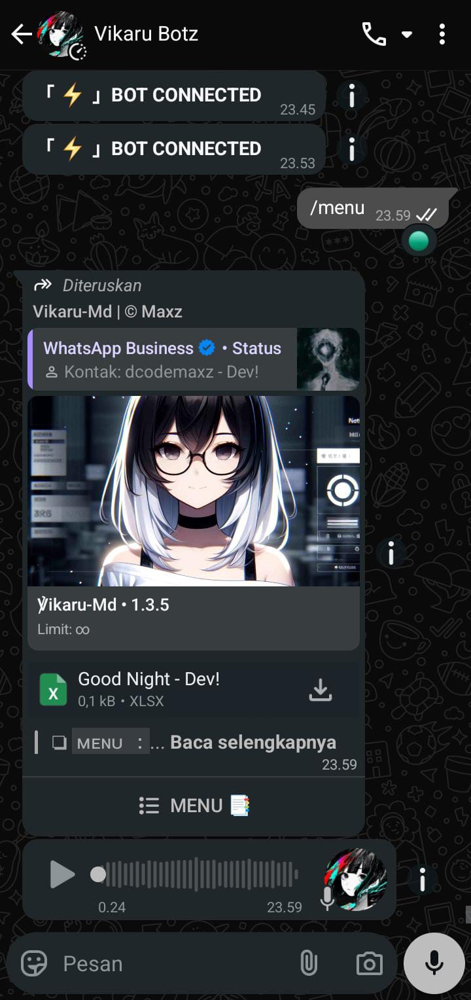
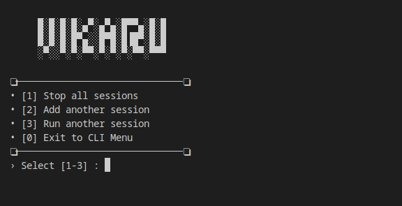
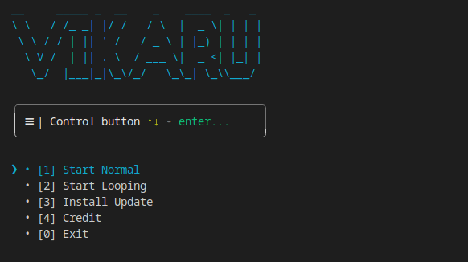

##### Perhatian ( Indonesian )

Jika kamu menggunakan chrome kamu bisa mengetuk titik 3 yang ada di pojok kanan atas lalu pilih opsi "Terjemahkan..."

---

# <div align='center'>Vikaru-Md | WhatsApp Bot Multidevice</div>

<div align="center">


<br/>

<!-- Badges -->
<p>
  
  
  
  
  
</p>

<!-- GitHub Stats -->
<p>
  
</p>

<!-- WhatsApp Links -->
<p>
  <a href="https://whatsapp.com/channel/0029Vaf6Op06buMMjrTouL26">
    
  </a>
  <a href="https://wa.me/6289508899033">
    
  </a>
</p>

</div>


## # How to install Vikaru-Md

- Open your terminal / Ubuntu / [Termux](https://github.com/termux/termux-app/releases/tag/)
- Update your terminal ( opsional )
```
apt update && apt upgrade -y
```
- Install git
```
apt install git
```
- Install bash
```
apt install bash
```
- Clone Vikaru-Md repo ( vip only )
```
git clone https://github.com/dcodemaxz/vikaru-md
```
---

## # Vikaru-Md | ( start )
- Enter the file storage directory
```
cd vikaru-md
```
- Start bot
```
bash start.sh
```
- Select option looping / normal
- Enter password
```
****
```
- Enter the WhatsApp number (62: country code)
```
628xxxx
```
- Then copy the pairing code and enter the code via the WhatsApp notification that appears.
  
- Wait until it enters, then name the device as you wish.

- Then try sending a simple cmd to the bot number
```
/menu
```


---

## # Vikaru-Md | ( CLI menu )



Manage sessions in real time while nodejs is running by simply pressing "enter"
- Stop all session : Stops all running bot sessions/numbers
- Add another session : Adding new bot session/number
- Run another session : Run another available session in the session list

---

## # Feature info

### [ 1 ] start.sh



Automatically restart the bot if the server closes due to over-limit/error
- 1 Start Normal : The bot will start normally and if there is a fatal error the bot will stop running.
- 2 Start Looping : The bot will start looping and if there is a fatal error the bot will restart automatically.
- 3 Install Update : Updates files directly and will overwrite existing files. Make sure you have backed up other important files such as "database" folders and others.


### [ 2 ] vikaru-md

Vikaru-Md is a multi-device WhatsApp bot designed to easily meet various needs, including AI, tools, group management, bug management, and business management. This bot offers comprehensive and unique features, such as:

#### • [ Fitur Lainnya ]
- Pairing code
- Custom pairing
- CLI Interactive menu
- Password and whitelist system when index.js is run
- The code is neat and easy to modify
- Multi prefix
- Multi session (can run on multiple numbers)
- Innovative interface/log display
- Anti call
- Anti link grup
- Anti promosi
- Anti Toxic
- Anti culik bot ke grup
- Anti Virtex/Spam
- Welcome, Leave, promote, and demote messages
- Pushkontak
- Vn automatic voice
- Auto AI

#### • [ Menu Utama ]
- Other Menu
- Ai Menu
- Convert Menu
- Search Menu
- Anime Menu
- Bug Menu
- Tools Menu
- Group Menu
- System Menu

---

## # Script Info 
You can buy this script via this [Telegram](https://t.me/dcodemaxz) / [WhatsApp](https://wa.me/6289508899033)

Buyer benefits :
- Get free updates ( No Expired )
- Update every week
- Given guidance to modify
- Guided to be able to develop bots

You can also use and see the bot features via community [group](https://chat.whatsapp.com/JfpGsd5GPh5EzvRVjm54tx)

---

## # Contributing
Feel free to contribute by opening issues or pull requests. Your feedback and contributions are highly appreciated.

---

## # License
This project is licensed under the [MIT License](LICENSE).
